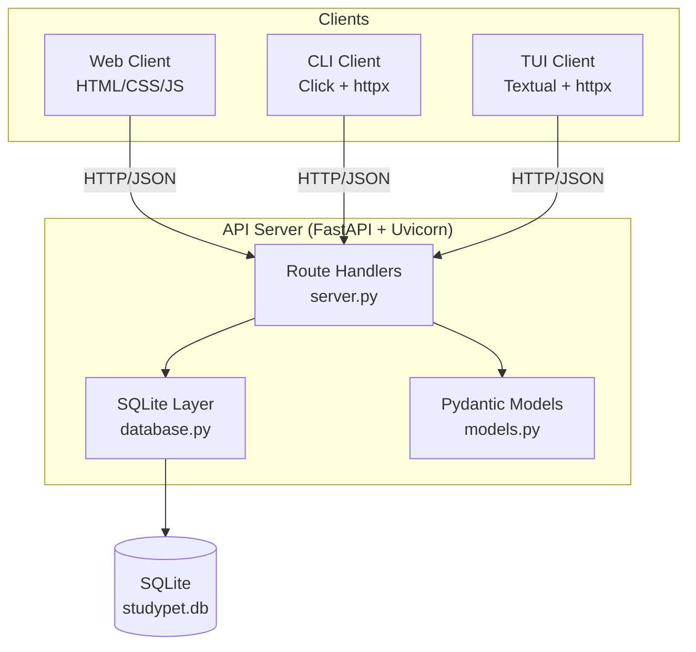

# StudyPet

A virtual pet productivity tracker built in Python. Add tasks, complete them, earn XP, level up your pet, and watch its mood shift based on how productive you've been.

## Architecture



All three clients communicate **only** through the REST API — no client touches SQLite directly.

## Project Structure

```
StudyPet/
├── src/studypet/
│   ├── models.py        # Pydantic v2 models (Task, Pet, etc.)
│   ├── database.py      # SQLite layer (all DB logic lives here)
│   └── server.py        # FastAPI app + route handlers
├── cli/
│   └── cli.py           # CLI client — Click + httpx
├── tui/
│   └── tui.py           # TUI client — Textual + httpx
├── web/
│   ├── index.html       # Web client markup
│   ├── style.css        # Styles
│   └── app.js           # Fetch-based API client
├── tests/
│   ├── test_database.py # 19 database-layer tests
│   └── test_server.py   # 14 API endpoint tests
├── docs/
│   ├── requirements.md
│   ├── architecture.md
│   ├── architecture.mmd
│   ├── api.md
│   └── testing-plan.md
├── pyproject.toml
└── CLAUDE.md
```

## Quick Start

**Requirements:** Python 3.11+, [uv](https://docs.astral.sh/uv/)

```bash
# 1. Install all dependencies
uv sync

# 2. Start the API server  (http://127.0.0.1:8000)
uv run studypet-server

# 3. Choose a client — open a second terminal for each:

# CLI
uv run studypet-cli --help

# TUI
uv run studypet-tui

# Web — open this file in any browser (server must be running)
web/index.html
```

## API Endpoints

| Method | Endpoint | Description |
|--------|----------|-------------|
| GET | `/pet` | Get pet status (name, level, XP, mood) |
| POST | `/tasks` | Create a new task |
| GET | `/tasks` | List all tasks (`?completed=true/false` to filter) |
| PUT | `/tasks/{id}/complete` | Complete a task and earn XP |
| DELETE | `/tasks/{id}` | Delete a task |

Interactive docs available at `http://127.0.0.1:8000/docs` when the server is running.
Full reference: [docs/api.md](docs/api.md)

## CLI Commands

```bash
uv run studypet-cli pet                        # show pet status
uv run studypet-cli tasks                      # list all tasks
uv run studypet-cli tasks --completed false    # pending only
uv run studypet-cli tasks --completed true     # completed only
uv run studypet-cli add "Title" -d "Desc"      # add a task
uv run studypet-cli complete <id>              # complete a task
uv run studypet-cli delete <id>               # delete a task
```

## TUI Keybindings

| Key | Action |
|-----|--------|
| `c` | Complete selected task |
| `d` | Delete selected task |
| `r` | Refresh pet and tasks |
| `q` | Quit |

## Pet Mechanics

- Each completed task awards **25 XP**
- **Level** = `(total XP // 100) + 1`
- **Mood** is computed from tasks completed in the last 24 hours:

| Tasks today | Mood |
|-------------|------|
| 0 | sad |
| 1–2 | okay |
| 3–4 | happy |
| 5+ | ecstatic |

## Running Tests

```bash
uv run pytest                          # all 33 tests
uv run pytest -v                       # verbose output
uv run pytest tests/test_database.py  # 19 database-layer tests
uv run pytest tests/test_server.py    # 14 API endpoint tests
```

Tests use in-memory SQLite — no running server needed, no test files left on disk.

## Environment Variables

| Variable | Default | Purpose |
|----------|---------|---------|
| `STUDYPET_URL` | `http://127.0.0.1:8000` | API base URL for CLI and TUI clients |
| `STUDYPET_DB` | `studypet.db` | Path to the SQLite database file |
| `STUDYPET_HOST` | `127.0.0.1` | Host the server binds to |
| `STUDYPET_PORT` | `8000` | Port the server listens on |

## Dependencies

| Package | Purpose |
|---------|---------|
| `fastapi` + `uvicorn` | REST API server |
| `pydantic` | Request/response models |
| `httpx` / `httpx2` | HTTP client for CLI and TUI |
| `click` | CLI framework |
| `textual` | Terminal UI framework |
| `pytest` | Test runner |

All managed by [uv](https://docs.astral.sh/uv/) via `pyproject.toml`.
