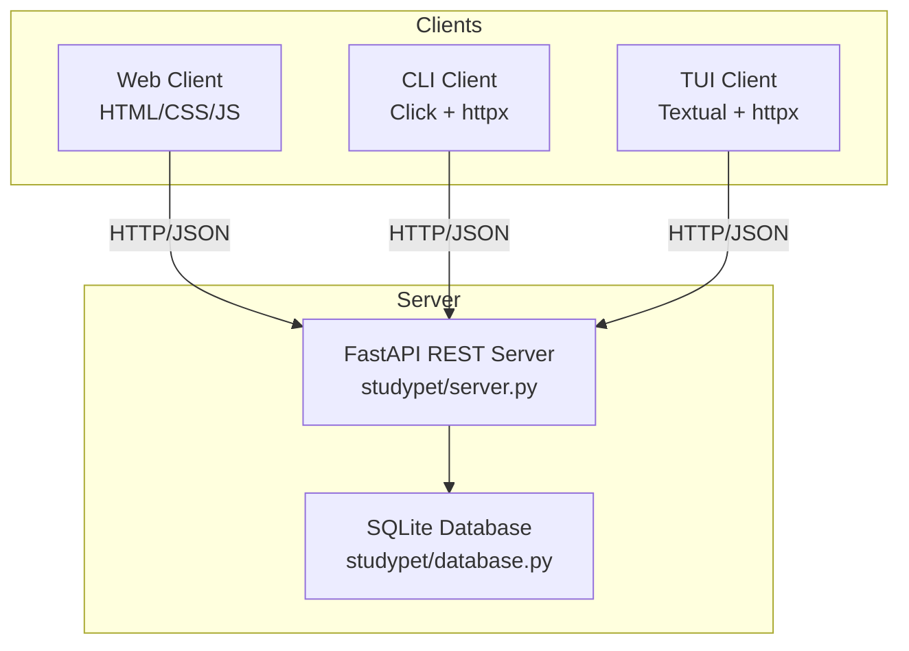

# StudyPet

A virtual pet productivity tracker. Add tasks, complete them, earn XP, level up your pet, and watch its mood shift based on how productive you've been.

## Architecture



All three clients communicate **only** through the REST API — no client touches SQLite directly.

## Project Structure

```
StudyPet/
├── src/studypet/        # Server package
│   ├── models.py        # Pydantic models
│   ├── database.py      # SQLite layer
│   └── server.py        # FastAPI app
├── cli/cli.py           # CLI client (Click + httpx)
├── tui/tui.py           # TUI client (Textual + httpx)
├── web/                 # Web client (HTML/CSS/JS)
├── tests/               # pytest test suite
└── docs/                # Documentation
```

## Quick Start

**Requirements:** Python 3.11+, [uv](https://docs.astral.sh/uv/)

```bash
# Install dependencies
uv sync

# Start the API server (default: http://localhost:8000)
uv run studypet-server

# In a second terminal — use the CLI
uv run studypet-cli --help

# Or launch the TUI
uv run studypet-tui

# Or open web/index.html in your browser
```

## API Endpoints

| Method | Endpoint | Description |
|--------|----------|-------------|
| GET | `/pet` | Get pet status (name, level, XP, mood) |
| POST | `/tasks` | Create a new task |
| GET | `/tasks` | List all tasks |
| PUT | `/tasks/{id}/complete` | Complete a task and earn XP |
| DELETE | `/tasks/{id}` | Delete a task |

See [docs/api.md](docs/api.md) for full request/response details.

## Pet Mechanics

- Each completed task awards **25 XP**
- **Level** = `(total XP // 100) + 1`
- **Mood** is based on tasks completed in the last 24 hours:
  - 0 tasks → 😢 sad
  - 1–2 tasks → 😐 okay
  - 3–4 tasks → 😊 happy
  - 5+ tasks → 🤩 ecstatic

## Running Tests

```bash
uv run pytest
uv run pytest -v          # verbose
uv run pytest tests/test_database.py   # single file
```

## My Questions

1. **How does AI assistance change the way developers learn and understand code?**
   When AI tools write or suggest code, developers can move faster — but there's a risk of accepting code without fully understanding it. In building StudyPet, I noticed that AI suggestions were most helpful when I already understood the problem well enough to evaluate them critically. This raises the question: does AI assistance strengthen or weaken deep understanding over time, and how should CS education adapt to this reality?

2. **Where should the line be drawn between AI-generated code and a student's own work?**
   AI-assisted development is now unavoidable in industry, yet academic integrity policies haven't fully caught up. For a project like StudyPet, the architecture decisions, debugging, integration work, and understanding of *why* the code works are genuinely mine — even if AI helped write boilerplate. How should instructors evaluate "authorship" when AI is part of the toolchain, and what skills should be prioritized in assessment?
