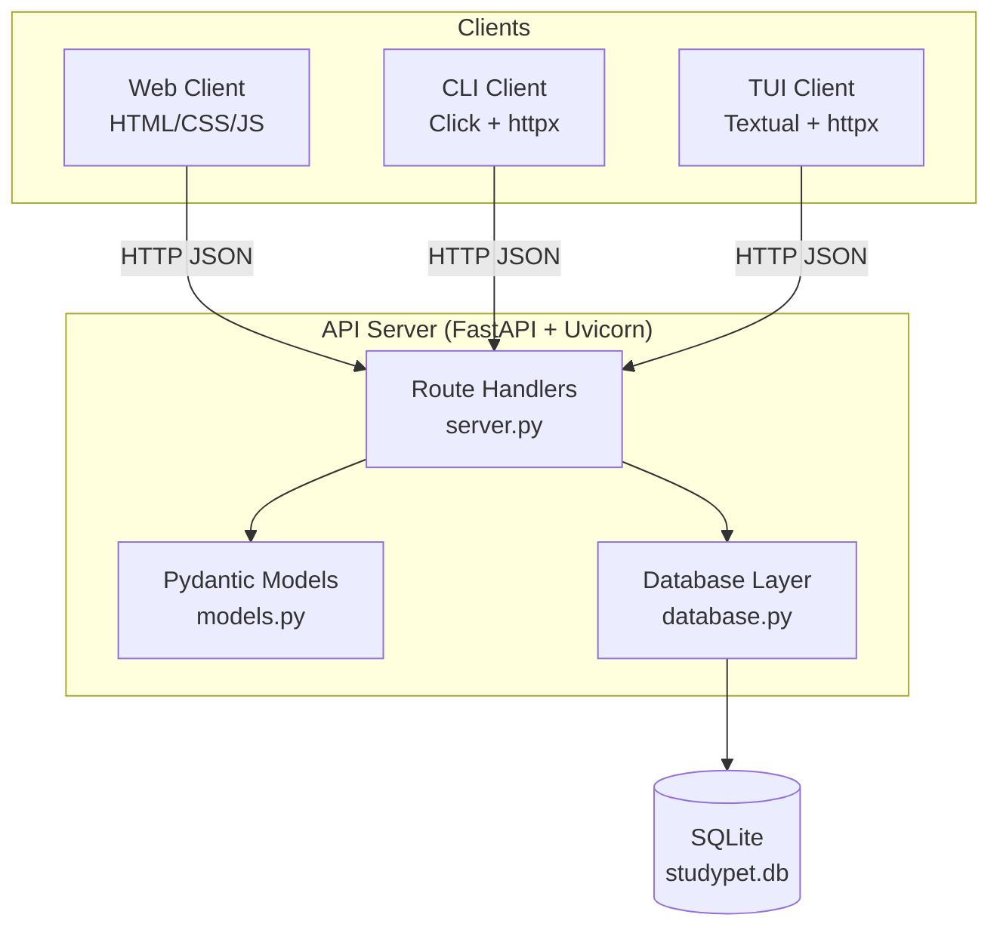

# Architecture — StudyPet

## Overview

StudyPet follows a **client–server** architecture. A single FastAPI process owns
the SQLite database; all three clients (CLI, TUI, web) communicate with it
exclusively through the REST API over HTTP/JSON.

## Component Diagram



## Data Flow: Completing a Task

```
Client                 Server (FastAPI)          Database
  |                         |                        |
  |-- PUT /tasks/1/complete->|                        |
  |                         |-- get_task(1) -------->|
  |                         |<-- Task row -----------|
  |                         |-- mark_complete(1) --->|
  |                         |-- add_xp(25) -------->|
  |                         |<-- updated pet --------|
  |<-- 200 {pet, task} -----|                        |
```

## Technology Choices

| Concern | Choice | Reason |
|---------|--------|--------|
| Web framework | FastAPI | Automatic OpenAPI docs, async support, Pydantic integration |
| Database | SQLite (stdlib) | Zero setup, portable, appropriate for single-user scope |
| CLI | Click | Declarative, composable commands |
| TUI | Textual | Rich terminal UI with reactive components |
| HTTP client | httpx | Sync and async support, clean API |
| Test runner | pytest | Industry standard, easy fixtures |

## Deployment

All components run locally:

1. `uv run studypet-server` — starts FastAPI on `http://localhost:8000`
2. Clients connect to that URL (override with `STUDYPET_URL` env var)
3. Database file `studypet.db` is created automatically on first server start
